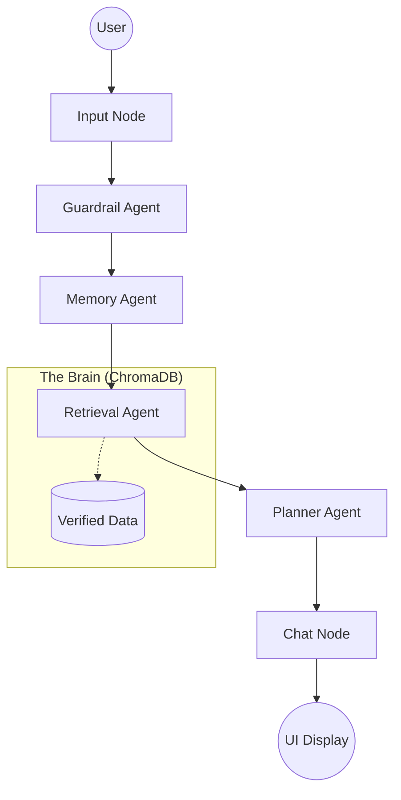

# EuroPlan AI: Multi-Agent Travel Planner

### Deployment: (https://huggingface.co/spaces/dhanushree16/europe-planner)
### Demo Link: https://drive.google.com/file/d/1LA-p3Mpq4zEIH3jGpBvbiGM9ewNqFPrS/view?usp=drive_link

**EuroPlan AI** is a multi-agent travel reasoning system designed to eliminate AI "hallucinations" and provide geographically accurate, personalized European itineraries.

---

## What We Built (The Implementation)

### 1. **Strict Geographic Grounding**
Forget AI hallucinations. EuroPlan uses a custom **ChromaDB Vector Store** to cross-reference every suggestion against real-world documents. If a city isn't in the verified database, the AI will admit it rather than making up a fake plan.

### 2. **Intelligent "Vibe" Engine**
The system dynamically adapts its reasoning based on the traveler type:
- **Couples**: Romantic spots and scenic viewpoints.
- **Groups**: Adventurous activities and social hotspots.
- **Families**: Kid-friendly zones and educational museums.
- **Negation Awareness**: If you say "no kids," the system strictly avoids child-friendly tags and amenities.

### 3. **Stateful Conversation (LangGraph)**
Unlike a simple chatbot, EuroPlan uses a **LangGraph orchestrated pipeline** that manages conversation flow:


- **Guardrail Agent**: Ensures safety and blocks non-European requests.
- **Memory Agent**: Tracks your budget, duration, and preferences across the chat.
- **Planner Agent**: Generates a high-precision day-by-day JSON itinerary.
- **Chat Agent**: Summarizes the plan in a warm, ChatGPT-like conversational tone.

### 4. **Premium "Glassmorphism" UI**
A high-end, dark-themed interface featuring:
- **Interactive Sidebar**: Real-time rendering of your day-by-day itinerary and budget.
- **Agent Justification**: A window into the AI's "internal thoughts" and reasoning steps.
- **Dynamic Context Bar**: Always showing you what the AI currently "knows" about your trip.

---

## 🛠 Tech Stack

- **Backend**: Python 3.13 (Anaconda/Stable), FastAPI, Uvicorn.
- **AI Orchestration**: LangGraph (Stateful Agent Workflows).
- **Vector Database**: ChromaDB (AI-powered document retrieval).
- **Embeddings**: `all-MiniLM-L6-v2` (Sentence Transformers).
- **Frontend**: Vanilla HTML5, CSS3 (Modern Glassmorphism), JavaScript (Asynchronous State Mgmt).

---

## ⚙️ Installation & Setup

### 1. Environment Setup
**CRITICAL**: This project is optimized for **Python 3.13**. (Python 3.14 has known compatibility issues with `pydantic v1` used by some dependencies).

```bash
# Recommended: Create a clean environment
conda create -n europlan python=3.13
conda activate europlan

# Install dependencies
pip install -r requirements.txt
```

### 2. Provider API Key
Create a `.env` file in the root directory:
HF_TOKEN=
DATASET_PATH=data/dataset.json
LOCAL_LLM_BASE_URL=http://localhost:11434/v1
LLM_MODEL=llama3.2:1b


---

## 🏃‍♂️ How to Run

1. **Start the Backend Server**:
   ```bash
   uvicorn backend.main:app --reload
   ```
2. **Launch the Frontend**:
   Simply open `frontend/index.html` in any modern web browser or use a Live Server.

---

**Happy Traveling with EuroPlan AI!** ✈️
