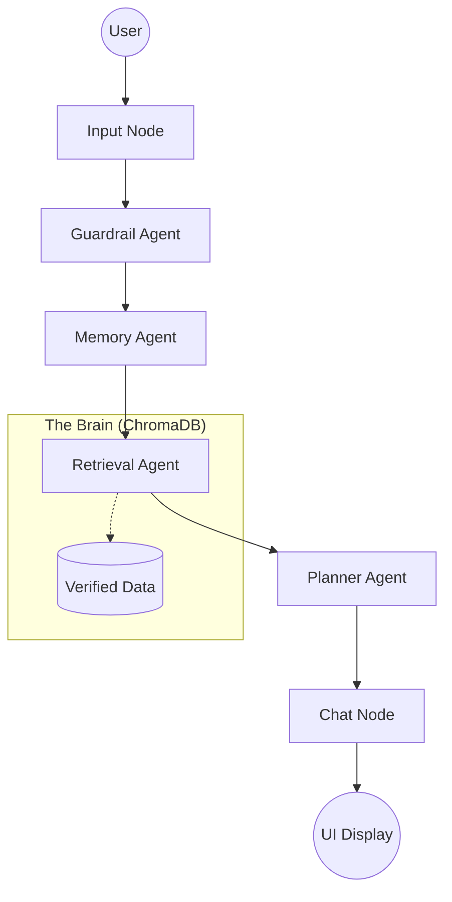

# EuroPlan AI: Multi-Agent Travel Planner

EuroPlan AI is a multi-agent travel reasoning system that involves an AI-based travel planning model for generating structured, geographically consistent, and grounded travel itineraries. The model combines Retrieval-Augmented Generation (RAG) techniques with stateful orchestration to produce structured and contextually grounded itineraries. 

This repository contains **two distinct versions** of the system, each showcasing different capabilities and deployment strategies.

---

## Version 1: Full Multi-Agent System (Flexible Input)

### Overview
This version focuses on **accuracy and flexibility**, allowing users to input travel queries in natural language.

### Features
- Hallucination-Free Planning (strict RAG grounding)
- Flexible user input (natural prompts)
- Multi-agent reasoning with:
  - Guardrail Agent  
  - Memory Agent  
  - Retrieval Agent  
  - Planner Agent  
  - Vibe Engine  
- Personalized itineraries  
- Day-by-day travel plans  

### Tech Stack
- **Backend:** FastAPI (Python 3.13)  
- **Orchestration:** LangGraph  
- **Vector DB:** ChromaDB  
- **Embeddings:** all-MiniLM-L6-v2  
- **Frontend:** HTML, CSS, JavaScript  

### Deployment (Version 1)
- Frontend: Vercel  
- Backend: Hugging Face Spaces  

### Live Demo (Version 1)
- App: https://europe-trip-ashen.vercel.app/
- Demo: https://drive.google.com/file/d/1vdo0tYsaJwRDGS33LfnKmHOAb89Gb4ib/view?usp=sharing

### Limitations
- Requires relatively structured prompts for best results  
- No real-time data (static vector database)  
- Europe-only domain restriction  
- Possible latency due to free-tier inference APIs  

---

## Version 2: Controlled Input System (UI-Driven)

### Overview
This version focuses on **structured interaction and UI-driven inputs**, ensuring consistency by restricting user choices.

### Features
- Predefined inputs for:
  - Days  
  - Budget  
  - Destinations  
  - Group Type (Solo, Couple, Friends, Family)  
- Strong geographic grounding via ChromaDB  
- Stateful conversation using LangGraph  
- Enhanced “Vibe Engine” with negation awareness  

### UI Highlights
- Interactive Glassmorphism interface  
- Real-time itinerary sidebar  
- Agent reasoning view  
- Dynamic context tracking  

### Tech Stack
- **Backend:** FastAPI (Python 3.13)  
- **Orchestration:** LangGraph  
- **Vector DB:** ChromaDB  
- **Embeddings:** all-MiniLM-L6-v2  
- **Frontend:** HTML, CSS, JavaScript (Glassmorphism UI)  

### Deployment (Version 2)
- Fully deployed on Hugging Face Spaces  

### Live Demo (Version 2)
- App: https://huggingface.co/spaces/dhanushree16/europe-planner
- Demo: https://drive.google.com/file/d/1LA-p3Mpq4zEIH3jGpBvbiGM9ewNqFPrS/view?usp=sharing

### Limitations
- Limited predefined options only  
- No support for custom/free-form inputs  
- Fixed ranges for budget, duration, and destinations  

---

### **Stateful Conversation (LangGraph)**
EuroPlan uses a **LangGraph orchestrated pipeline** that manages conversation flow:


- **Guardrail Agent**: Ensures safety and blocks non-European requests.
- **Memory Agent**: Tracks your budget, duration, and preferences across the chat.
- **Planner Agent**: Generates a high-precision day-by-day JSON itinerary.
- **Chat Agent**: Summarizes the plan in a warm, ChatGPT-like conversational tone.


## Installation & Setup

### 1. Environment Setup
**CRITICAL**: This project is optimized for **Python 3.13**. (Python 3.14 has known compatibility issues with `pydantic v1` used by some dependencies).

```bash
# Recommended: Create a clean environment
conda create -n europlan python=3.13
conda activate europlan

# Install dependencies
pip install -r requirements.txt
```

### 2. Local LLM
Create a `.env` file in the root directory:
HF_TOKEN=
DATASET_PATH=data/dataset.json
LOCAL_LLM_BASE_URL=http://localhost:11434/v1
LLM_MODEL=llama3.2:1b

---

## How to Run

1. **Start the Backend Server**:
   ```bash
   uvicorn backend.main:app --reload
   ```
2. **Launch the Frontend**:
   Simply open `frontend/index.html` in any modern web browser or use a Live Server.

---

**Happy Traveling with EuroPlan AI!** ✈️
